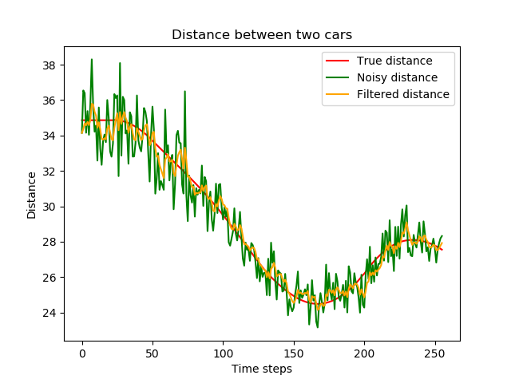

# Highway Simulation

This short project explores machine learning algorithms that are relevant to automotive driving. 
In short, self-driving devices take decisions based on information collected by sensors.
We implement simple systems dynamics based on that information.

For simplicity, cars are represented by punctual object on the plane. 
They are constrained to move in the center of a lane.
Changing lanes is instantaneous: the point representing the car can jump from one lane to a neighboring lane.
The highway is a stretch of straight road with customizable length and number of lanes.
It has no exit or entrance.
The information collected by sensors comes, for the sake of simplicity, with a car id and a noisy relative position.
We assume the angular component is always collected perfectly, while the distance component is noisy, with the variance of the noise varying like the distance squared.
Initially cars are randomly scattered on the road, and the density of cars is uniform.

## Denoising sensor information

- Kalman filters
Let's run a simulation and pick 2 cars. One will be the source, the other one will be the target for this experiment.
After the simulation is done, plot the true relative distance between the cars against time, as well as the noisy distances (messages sent from the source to the target), and the filtered distances (inferred distance based on noisy observations).

We also get the following mean squared errors for a simulation with 20 cars (20 * 19 ordered pairs of cars):

Filtered MSE mean: 10.6; Filtered MSE standard deviation: 28.2
Noisy MSE mean: 60.0; Noisy MSE standard deviation: 163.4

Interestingly, the fact that the variance of the noise varies in  can lead to biased results.

## Simulation

## Test
- Kalman filters
- Particle filters
- Gaussian processes
